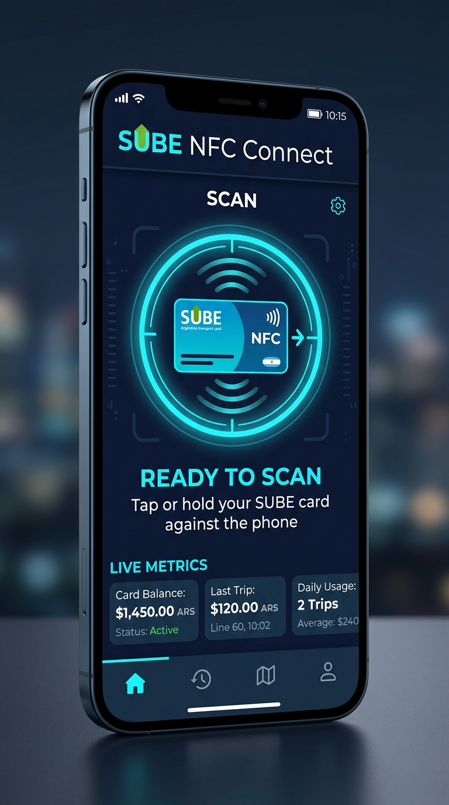

# 💳 SUBE NFC Connect


[](https://sube-nfc-connect.lucaslean1806.workers.dev/)

Aplicación nativa para Android diseñada para la lectura, consulta, acreditación de cargas y análisis de tarjetas de transporte público **SUBE** (Argentina).

**🌐 Landing demo:** https://sube-nfc-connect.lucaslean1806.workers.dev/ (`index.html` en la raíz, Tailwind vía CDN).

---

## 📱 Vista Previa de la Aplicación (App Preview)

<p align="center">
  
</p>

---

## 🚀 Características Principales

- 📡 **Escáner y Visualizador NFC de Alta Tecnología**:
  - Componente animado interactivo `NfcScanAnimationVisual` en Jetpack Compose.
  - Simulación de campo de radiofrecuencia (RF), barrido de radar en tiempo real y flujo de estado APDU (ISO 14443-A).
  - Animación de tarjeta aproxima / tap dinámico sobre la antena NFC.

- 📊 **Gráfico de Consumo Mensual (Jetpack Compose Nativo)**:
  - Visualización interactiva mediante gráfico de líneas suaves y relleno de área `MonthlySpendingChart`.
  - Comparativa visual entre **Gastos en viajes** y **Cargas acreditadas** de los últimos 6 meses.
  - Selección táctil interactiva de meses y cálculo de ahorros con tarifa RED SUBE.

- 🔋 **Tema Dinámico Material 3 & Modo OLED Negro**:
  - **Modo OLED Negro (Ahorro Batería)**: Fondo `#000000` con píxeles completamente apagados para reducir el consumo en pantallas AMOLED/OLED.
  - Alternador dinámico accesible desde el menú superior entre modos **OLED**, **Oscuro**, **Claro** y **Sistema**.

- 📱 **Soporte Adaptador Puente / Modo Ligero (J7 & Teléfonos Antiguos)**:
  - Compatibilidad completa con hardware NFC nativo y modo emulador/puente para dispositivos con sensores de baja potencia.

- 🔒 **Seguridad y Persistencia Local**:
  - Almacenamiento seguro fuera de línea mediante **Room Database**.
  - Ocultación de saldos y autenticación biométrica (Huella Digital / PIN) para proteger el historial de transacciones.

---

## 🛠️ Tecnologías Utilizadas

- **Lenguaje**: Kotlin
- **UI Framework**: Jetpack Compose + Material Design 3
- **Arquitectura**: Clean Architecture / MVVM con ViewModel y StateFlow
- **Base de Datos**: Room Database
- **NFC**: Android NFC Adapter APIs + ISO 14443 APDU Handler Bridge
- **Gráficos y Animaciones**: Compose Canvas Drawing, Vector Paths, InfiniteTransition

---

## 🔨 Compilar

```bash
# Requiere Android Studio (Hedgehog+) con SDK 34
# 1. Abrir la carpeta del repo en Android Studio
# 2. Sync Gradle + Run en dispositivo con NFC
```

> El repo no incluye `gradlew` (wrapper): generarlo con
> `gradle wrapper` si compilás por CLI. `local.properties` (SDK path,
> firmas) nunca se commitea — ver `.gitignore`.

## 📦 Release

- Generar APK firmado desde *Build → Generate Signed Bundle/APK*.
- Adjuntar el APK como GitHub Release con screenshots y changelog.
